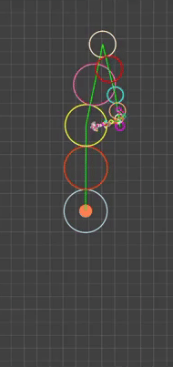
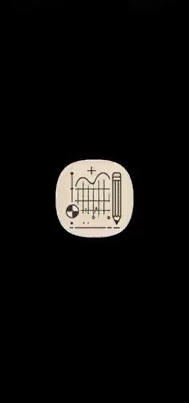

# FourierEpicycles
An Android app that transforms hand-drawn shapes into animated Fourier epicycles through mathematical decomposition and reconstruction.

The app captures a path traced on screen, refines it into a clean set of points, computes its Discrete Fourier Transform (DFT), and uses the resulting frequency components to recreate the shape through a cascading sequence of rotating vectors.

This generates a mesmerizing animation where circular motions combine to rebuild your original drawing using nothing but harmonic oscillations.

---

## 🎬 Preview

  
  

---

## ⚡ How It Works

### 1. Capture the Path
The app records a sequence of coordinates from the user's drawn input.  
This sequence forms the raw representation of the shape to be analyzed.

### 2. Simplify the Curve
The Ramer–Douglas–Peucker (RDP) algorithm intelligently reduces point density while maintaining the essential geometry of the curve.

### 3. Normalize the Points
The geometric center (centroid) of the curve is computed, and all coordinates are translated to center the drawing on screen.

### 4. Convert to Complex Representation
Each coordinate pair `(x, y)` is encoded as a complex number `x + yi`.  
The Fourier transform operates on this complex-valued signal to extract harmonic components.

### 5. Apply the Discrete Fourier Transform (DFT)
The DFT decomposes the signal into a collection of Fourier components, each characterized by:
- **frequency** – determines the rotation speed of its corresponding epicycle
- **amplitude** – defines the radius of the circular path
- **phase** – specifies the initial angular offset

These components collectively encode the entire curve as a sum of rotating phasors.

### 6. Sort the Components
The Fourier components are sorted by amplitude simply to improve the visual flow of the animation.  
Larger components appear first, creating a cleaner and more readable epicycle cascade.

### 7. Animate the Epicycles
Each Fourier component becomes a rotating vector in the animation.  
The vectors are linked tip-to-tip, and as they rotate, the endpoint of the chain draws the reconstructed shape over one full cycle.

---

## 📦 Download
Pre-built Android package is available in the **Releases** section.

1. Download the `.apk` file
2. Install it on your Android device
3. Open the app and start drawing

---